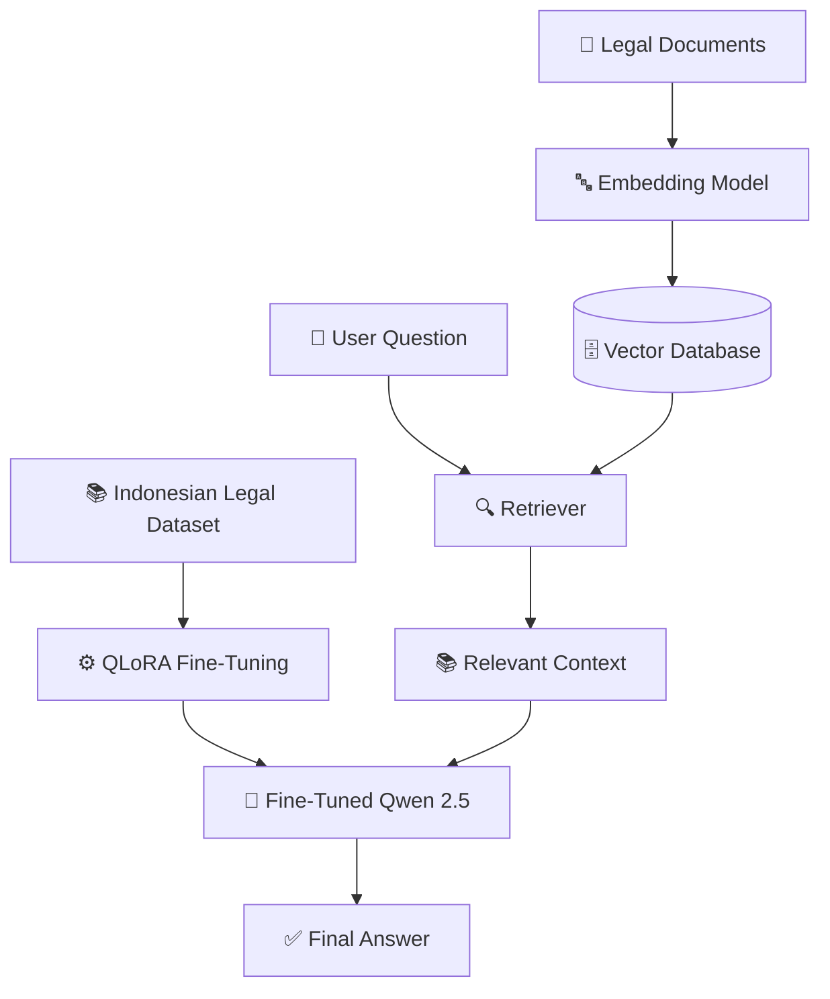
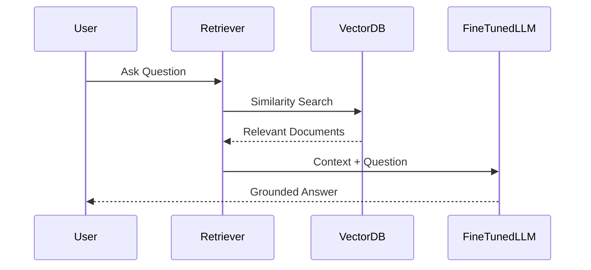

# ⚖️ Indonesian Legal AI Assistant

### Fine-Tuning + Retrieval-Augmented Generation (RAG)

> End-to-End Generative AI system that combines Fine-Tuning and Retrieval-Augmented Generation (RAG) to provide accurate and context-aware legal assistance in Bahasa Indonesia.

---

## 🚀 Project Overview

This project consists of two major stages:

### Stage 1 — Fine-Tuning

Qwen 2.5 1.5B is fine-tuned using Indonesian instruction datasets with QLoRA to improve domain understanding and response quality.

### Stage 2 — Retrieval-Augmented Generation (RAG)

The fine-tuned model is enhanced with a retrieval system that searches relevant legal documents before generating responses.

---

## 🏗️ End-to-End Architecture



---

# Part 1: Fine-Tuning

## 🎯 Objective

Improve the base model's understanding of Indonesian legal instructions.

### Techniques

* QLoRA
* LoRA Adapter
* PEFT
* 4-bit Quantization
* Unsloth Optimization

### Base Model

```text
Qwen2.5-1.5B
```

### Dataset

```text
Ichsan2895/alpaca-gpt4-indonesian
```

---

# Part 2: Retrieval-Augmented Generation

## 🎯 Objective

Reduce hallucination and provide answers grounded in legal documents.

### RAG Pipeline


---

## 📂 Knowledge Base

Legal documents are processed through:

1. Document Loading
2. Text Chunking
3. Embedding Generation
4. Vector Storage
5. Similarity Search

---

## 🧠 Why Combine Fine-Tuning and RAG?

| Fine-Tuning          | RAG                   |
| -------------------- | --------------------- |
| Learns behavior      | Retrieves knowledge   |
| Improves style       | Improves factuality   |
| Permanent knowledge  | Dynamic knowledge     |
| Expensive retraining | Easy document updates |

Together they provide:

✅ Better reasoning

✅ Better factual accuracy

✅ Lower hallucination rate

✅ More maintainable AI system

---

## 🛠 Tech Stack

| Category        | Technology            |
| --------------- | --------------------- |
| LLM             | Qwen 2.5              |
| Fine-Tuning     | QLoRA                 |
| PEFT            | LoRA                  |
| Framework       | Transformers          |
| Optimization    | Unsloth               |
| RAG Framework   | LangChain             |
| Vector Store    | ChromaDB              |
| Embedding Model | Sentence Transformers |
| Platform        | Google Colab          |

---

## 📈 System Workflow



---

## 🎯 Key Achievements

✅ Fine-Tuned Qwen 2.5 using QLoRA

✅ Built Retrieval-Augmented Generation pipeline

✅ Reduced hallucination through context retrieval

✅ Created domain-specific Indonesian Legal Assistant

✅ End-to-End Generative AI Workflow

---

## 🔮 Future Improvements

* Hybrid Search
* Reranking
* Agentic RAG
* LangGraph Workflow
* FastAPI Deployment
* Docker Containerization

```
```
